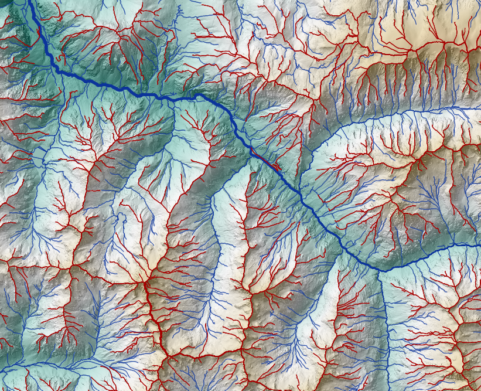

# LANDMARK: Python Implementation of Thalweg and Ridge Network Extraction

[](./LICENSE.txt)
[](https://www.python.org/)


This Python package provides a python implementation of the method proposed by Moretti and Orlandini (2023) for extracting physically meaningful thalweg and ridge networks directly from high-resolution, unaltered digital elevation models (DEMs). The extracted networks form the basis for a new approach to terrain partitioning that preserves essential topographic features without relying on depression filling or grid coarsening. This work is a direct translation of the original Fortran implementation described in the published article :


```{note}
Moretti, G., & Orlandini, S. (2023). Thalweg and ridge network extraction from unaltered topographic data as a basis for terrain partitioning. Journal of Geophysical Research: Earth Surface, 128, e2022JF006943. 
```
[https://doi.org/10.1029/2022JF006943](https://doi.org/10.1029/2022JF006943)


## Documentation

Full documentation is available at:

[https://IGNF.github.io/landmark/](https://IGNF.github.io/landmark/)

## What does it do?

`landmark` processes high-resolution DEMs to identify and extract interconnected thalweg and ridge networks without modifying the original elevation data. These networks are derived from a slopeline-based analysis and provide a physically consistent representation of convergent (thalweg) and divergent (ridge) terrain structures.

Key functionalities include:
- Detection of **ridge points** as local high-divide locations uncrossed by slopelines.
- Identification of **endorheic** and **exorheic** basins, and their connections through **spilling saddles**.
- Construction of a fully connected **thalweg network**, including within nested depressions.
- Derivation of a **ridge network** structured around dispersal areas.
- Support for **terrain partitioning** using extracted networks as breaklines, enabling unstructured mesh generation for hydrological or geomorphological modeling.

This tool is particularly useful in mountainous or lowland terrains where preserving depressions is essential for a meaningful representation of surface processes.




## Installation

To install the package, clone the repository and install it in editable mode.

### HTTP method

```bash
git clone https://github.com/IGNF/landmark.git
cd landmark
pip install -e .
```

### SSH method

```bash
git clone git@github.com:IGNF/landmark.git
cd landmark
pip install -e .
```


## Python Quick Start

You can use LANDMARK directly in Python by calling the main function:

```python
from landmark.main_landmark_geotiff import landmark_processing

landmark_processing(
    mnt_path="path/to/input_dem.tif",
    output_dir="path/to/output",
    a_spread=100000,
    a_out=100000,
    hso_th=5,
    curvature_slope=True,
    n_pts_calc_slope=5,
    no_data_values=[-9999, 0]
)
```

This will create two GeoPackage files containing slopelines and ridgelines respectively.

## Command Line Usage

You can also run LANDMARK as a command-line interface (CLI) after installing the package.

```bash
landmark path/to/dem.tif \
    --output_dir path/to/output \
    --a_spread 100000 \
    --a_out 100000 \
    --hso_th 5 \
    --curvature_slope \
    --n_pts_calc_slope 5 \
    --no_data_values -9999 0
```

### Arguments

| Argument            | Description                                                                | Default         |
|---------------------|----------------------------------------------------------------------------|-----------------|
| `mnt_path`          | Path to the input DEM (GeoTIFF format)                                     | *(required)*    |
| `--output_dir`      | Output directory for GeoPackage files                                      | `../../outputs` |
| `--a_spread`        | Threshold for ridge dispersal area (m²)                                    | `1e5`           |
| `--a_out`           | Threshold for drainage contributing area (m²)                              | `1e5`           |
| `--hso_th`          | Horton stream order threshold                                              | `5`             |
| `--curvature_slope` | Activate slope and curvature computation                                   | *(disabled)*    |
| `--n_pts_calc_slope`| Number of points for slope estimation                                      | `5`             |
| `--no_data_values`  | List of NoData values in the input DEM                                     | `[-9999, 0]`    |

### Output

Two GeoPackage files are created in the output directory:
- `slopelines_se_HSO_<input_name>.gpkg` – extracted thalweg network
- `ridgelines_se_HSO_<input_name>.gpkg` – extracted ridge network

These can be directly opened in QGIS or any GIS software for further analysis.

## Input DEM requirements

The input Digital Elevation Model must:

- Be a **GeoTIFF** file.
- Use a **projected coordinate system with metric units** (e.g., UTM, Lambert 93).  
Do **not** use a geographic CRS with degrees (such as WGS84 / EPSG:4326), as the algorithm relies on metric distances for all processing.  
Using degrees will result in **incorrect and unusable outputs**.

## License

This project is licensed under the MIT License. See the LICENSE.TXT file for details.